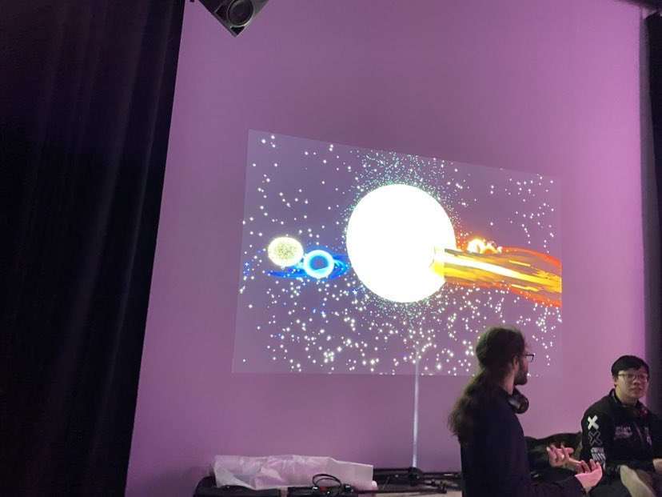

# Oeuvre : Canevas Cosmique
### Créateurs et créatrices
- Jacob Alarie-Brousseau
- Étienne Charron
- Jérémy Cholette
- Quoc Huy Do
- Mikaël Tourangeau

## Lien avec Crescentia
Canevas Cosmique est une expérience immersive où les visiteurs peuvent interagir avec une simulation de système solaire. À travers cette expérience, on explore la notion de création et de manipulation d'un univers cosmique. Le lien est que la créativité est présente lorsque l'on crée.

## Installation
<h5>Légende: Photo de l’œuvre en son ensemble.</h5>

<h5>Légende: Vidéo de l'oeuvre en action.</h5>
https://www.youtube.com/shorts/nxRehO2Amkc

## Schéma prévu pour l'installation

<h5>Légende: le schéma de l'œuvre</h5>

<h5> source: </h5> 

https://tim-montmorency.com/2024/projets/Canevas-Cosmique/docs/web/preproduction.html

## Lien de l'oeuvre
[Canevas-Cosmique](https://tim-montmorency.com/2024/projets/Canevas-Cosmique/docs/web/index.html)
