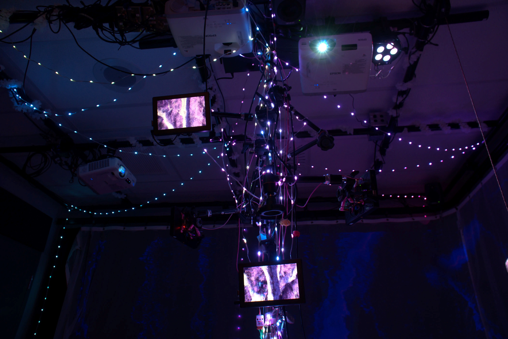
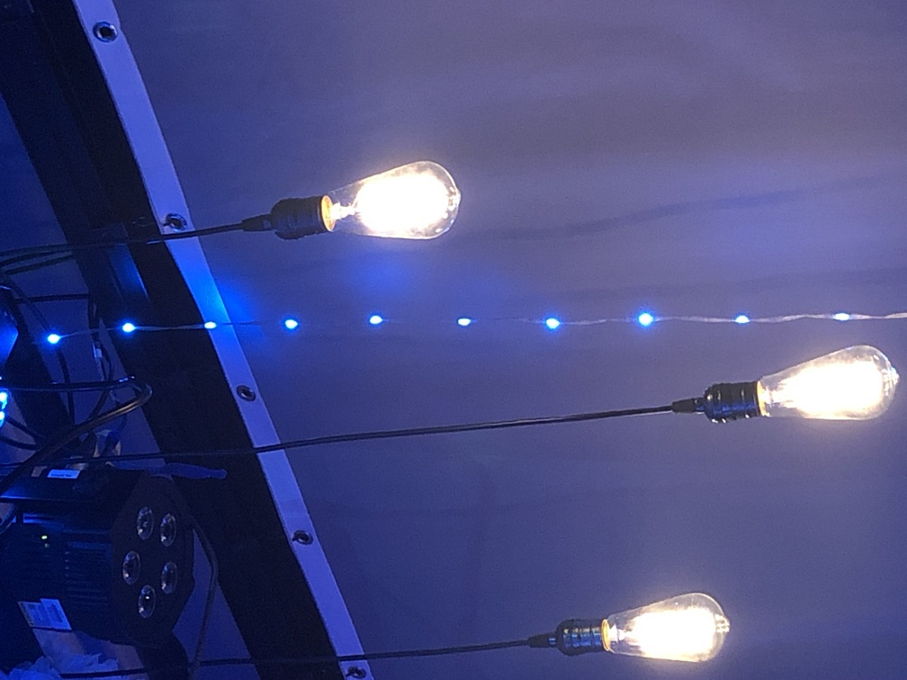
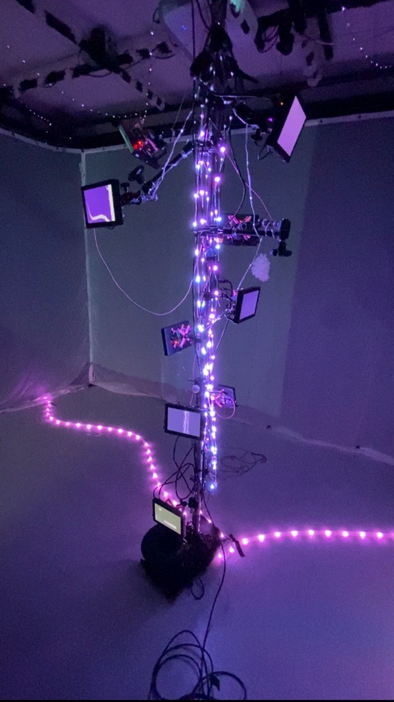
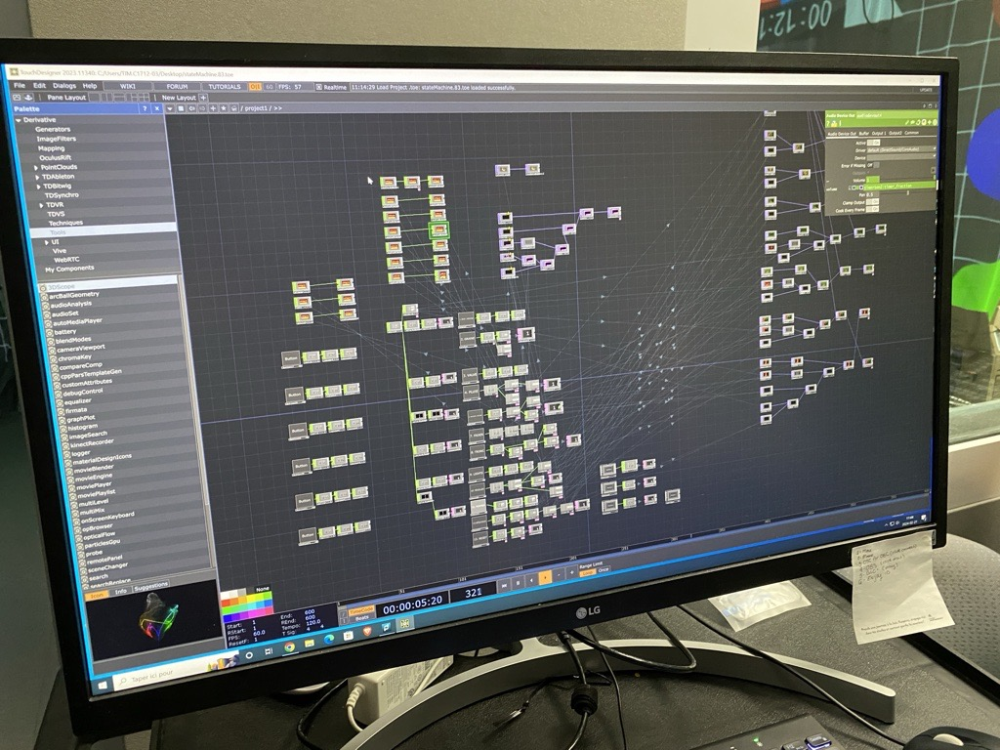

# Oeuvre : Effet Papillon
### Créateurs et créatrices
- Raphaël Dumont
- Alexis Bolduc
- William Morel
- Alexia (Ryan) Papanikolaou
- Viktor Zhuravlev
- Jasmine Lapierre

## Lien avec Crescentia
Effet Papillon présente une expérience immersive qui explore le cycle de vie d'un pommier, mettant en lumière l'effet papillon à travers des éléments électroniques. En invitant les visiteurs à participer à cette expérience, on souligne la complexité des conséquences résultant de choix apparemment minuscules, tout en offrant une réflexion sur le cycle de la vie. Effet Papillon incarne la vision de Crescentia avec la création d'une expérience multimédia engageante qui incite à la réflexion sur les interactions humaines.

## Installation
<h5>Légende: Photo des écrans</h5>

<h5>Légende: Photo de l'éclairage</h5>

<h5>Légende: Photo de l’œuvre en son ensemble.</h5>

<h5>Légende: Photo de la programmation de l’œuvre.</h5>

<h5>Légende: Photo de la programmation de l’œuvre.</h5>

‎ ‎ ‎ ‎ ‎‎ ‎ ‎ ‎ ‎ ‎ ‎ ‎‎ ‎‎ ‎ ‎ ‎‎  ‎ ‎ ‎ ‎ ‎ ‎‎ ‎ ‎ ‎‎  ‎‎ ‎ ‎‎ ‎ ‎

## Schéma prévu pour l'installation

<h5>Légende: le schéma de l'œuvre</h5>

<h5> source: </h5>
[EffetPapillon](https://tim-montmorency.com/2024/projets/Effet-Papillon/docs/web/preproduction.html)

## Lien de l'oeuvre
[EffetPapillon](https://tim-montmorency.com/2024/projets/Effet-Papillon/docs/web/index.html)
