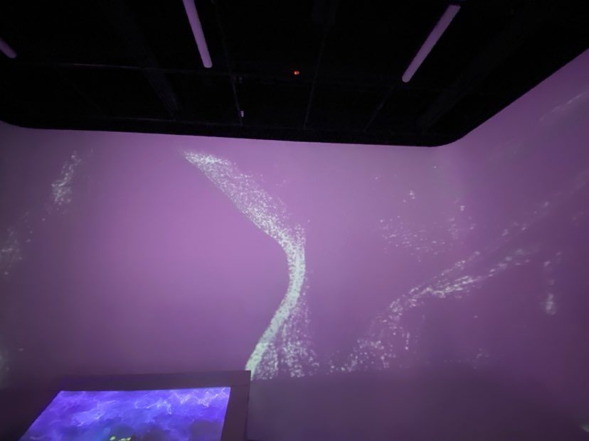
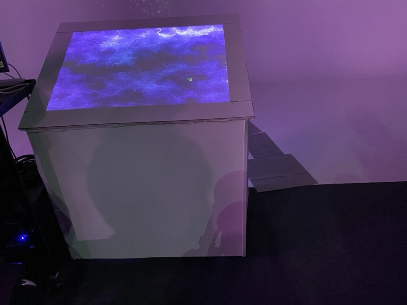
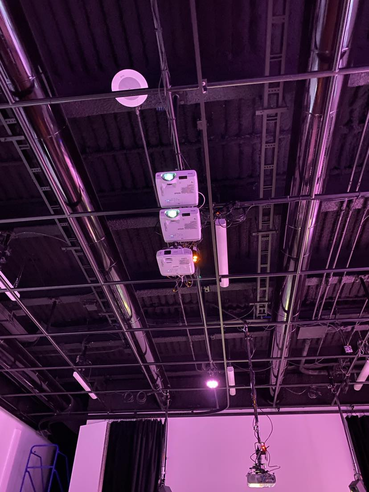

# Oeuvre : Rhizomatique
### Créateurs et créatrices
- Jolyanne Desjardins
- MaÏka Désy
- Laurie Houde
- Felix Testa Radovanovic

## Lien avec Crescentia
Rhizomatique explore la façon dont nous nous souvenons et interagissons avec le passé. En permettant aux visiteurs de naviguer à travers les souvenirs d'une personne inconnue, Rhizomatique correspond à l'objectif de Crescentia d'engager les gens dans une réflexion sur ce qui nous rend humains. La représentation du cerveau dans Rhizomatique reflète des souvenirs, établissant un lien avec la vision artistique globale de Crescentia.

## Installation
<h5>Légende: Photo de l’œuvre en son ensemble.</h5>

<h5>Légende: Vidéo de l'oeuvre en action.</h5>
https://www.youtube.com/watch?v=2UW57OXhWFQ

<h5>Légende: Photo du dispositif plus en détails</h5>

<h5>Légende: Photo de l'arrangement des fils de l'oeuvre.</h5>

## Schéma prévu pour l'installation

<h5>Légende: le schéma de l'œuvre</h5>

<h5> source: </h5>

[Rhizomatique](https://tim-montmorency.com/2024/projets/Rhizomatique/docs/web/index.html)

## Lien de l'oeuvre
[Rhizomatique](https://tim-montmorency.com/2024/projets/Rhizomatique/docs/web/index.html)
