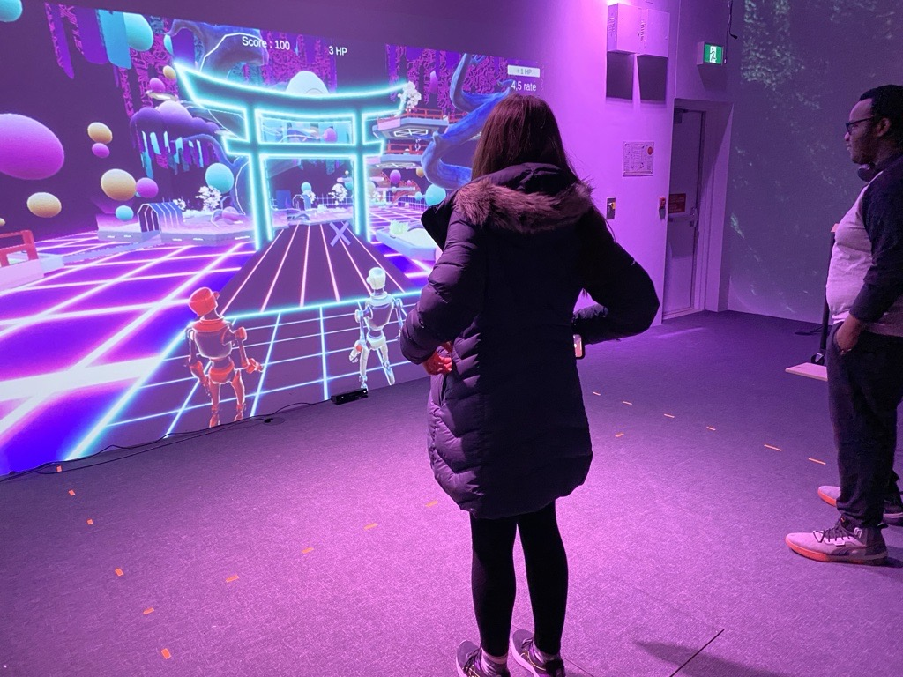
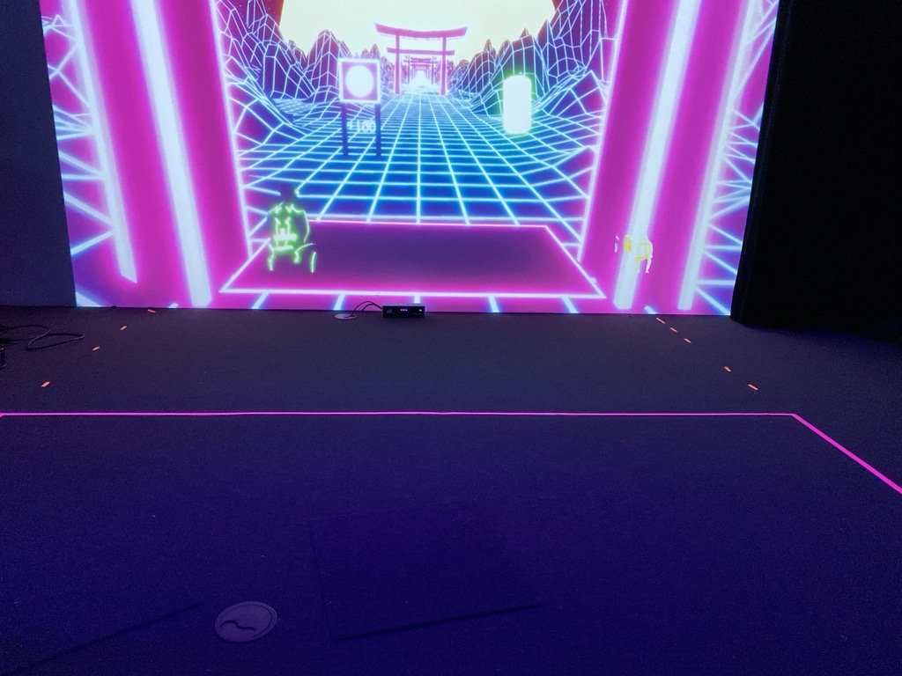
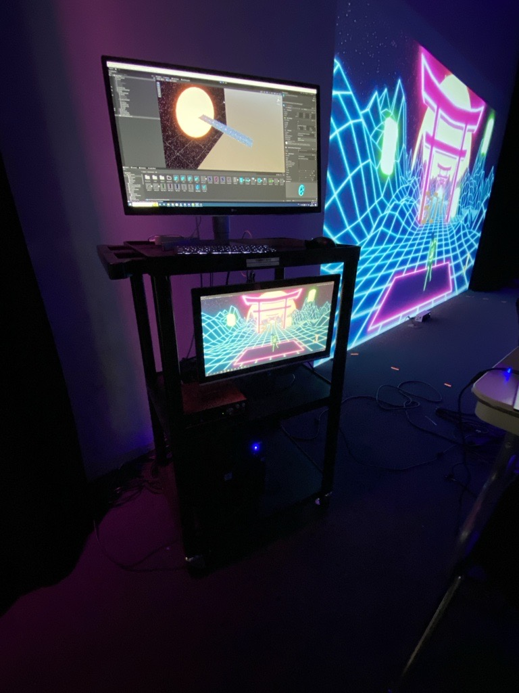
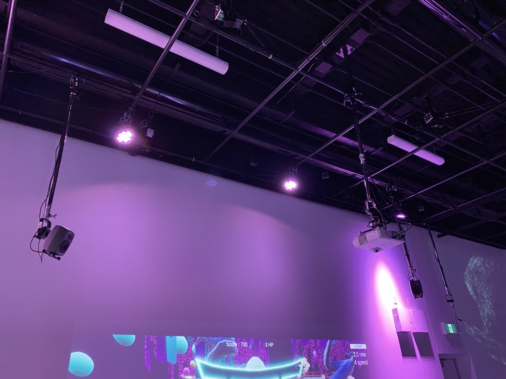
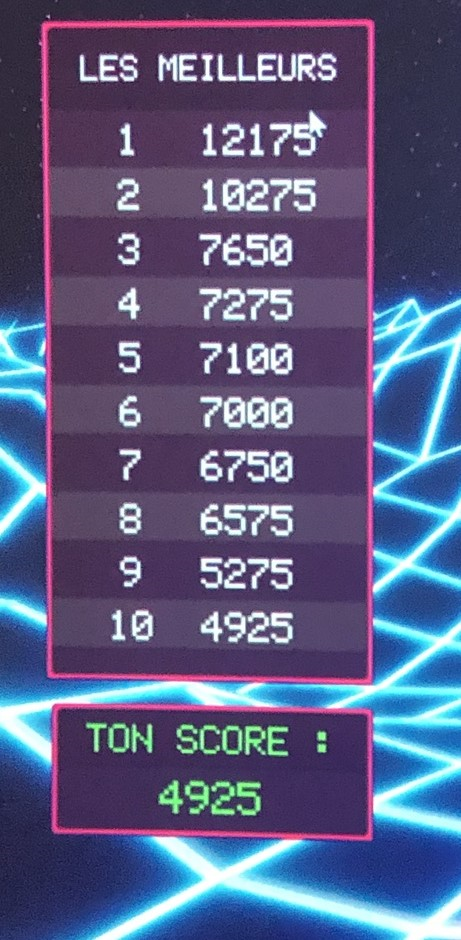

# Oeuvre : Kigo
### Créateurs et créatrices
- Érick Ouellette
- William Rathier Mailly
- Gabriel Clerval
- Nicolas St-Martin
- Antoine Dion

## Lien avec Crescentia
Kigo est un jeu interactif avec des visuels néon rétro changeants pour représenter les quatre saisons. Cette expérience engageante invite les participants à découvrir et à interagir avec un univers visuel dynamique. Crescentia pourrait être interprété comme une référence à la variété et au changement, ce qui explique le lien avec Kigo.

## Installation
<h5>Légende: Photo de l’œuvre en son ensemble.</h5>

<h5>Légende: Vidéo de l'oeuvre en action.</h5>
https://www.youtube.com/watch?v=V8n1xFRV3Dg

<h5>Légende: Photo de l'écran</h5>

<h5>Légende: Photo de la programmation de l’œuvre.</h5>

<h5>Légende: Photo de l'arrangement des fils de l'oeuvre.</h5>

<h5>Légende: ‎Photo de la liste des top scores.</h5>

## Schéma prévu pour l'installation

<h5>Légende: le schéma de l'œuvre</h5>

<h5> source: </h5> 

[Kigo](https://tim-montmorency.com/2024/projets/Kigo/docs/web/preproduction.html)

## Lien de l'oeuvre
[Kigo](https://tim-montmorency.com/2024/projets/Kigo/docs/web)
