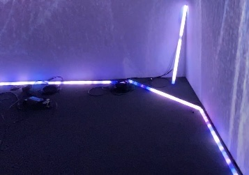
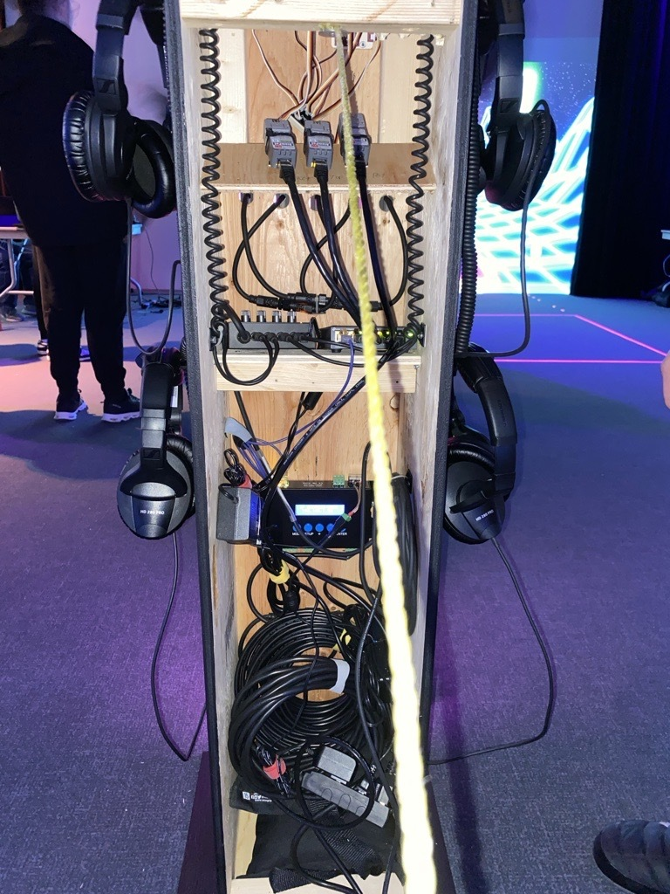

# Œuvre : Sonalux

## Créateurs et créatrices
- Antoine Haddad
- Camélie Laprise
- Ghita Alaoui
- Vincent Desjardins

## Lien avec Crescentia
L'exposition Sonalux offre une expérience multimédia immersive où les participants sont transportés dans un monde de voyage astral. À travers cette installation, Sonalux explore la notion de transcendance du temps et de l'espace, invitant les participants à devenir les maîtres de leur propre expérience grâce à l'interaction avec les instruments présentés sur le podium. Sonalux incarne la vision créative et immersive de Crescentia.

## Installation
<h5>Légende: Photo des boutons</h5>

<h5>Légende: Photo de l'éclairage</h5>

<h5>Légende: ‎Photo de l'installation et des branchements.</h5>

<h5>Légende: Photo de l’œuvre en son ensemble.</h5>

<h5>Légende: Vidéo de l'oeuvre en action.</h5>
https://www.youtube.com/watch?v=xyEWyEB-V-k

## Schéma prévu pour l'installation

<h5>Légende: le schéma de l'œuvre</h5>

<h5> source: </h5> 

[Sonalux](https://tim-montmorency.com/2024/projets/Sonalux/docs/web/index.html)

## Lien de l'œuvre
[Sonalux](https://tim-montmorency.com/2024/projets/Sonalux/docs/web/index.html)
