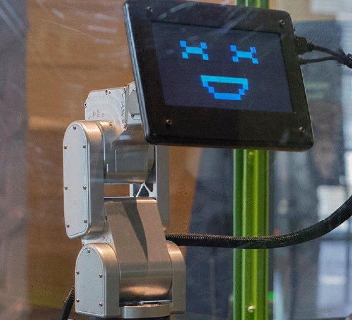
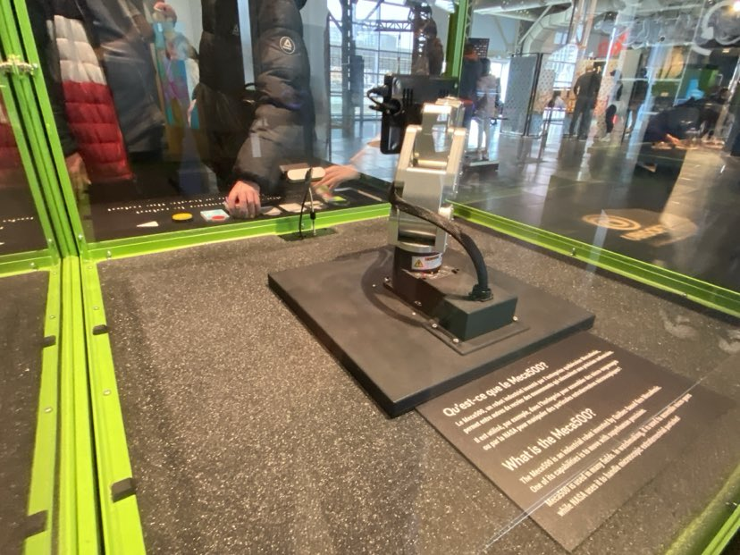
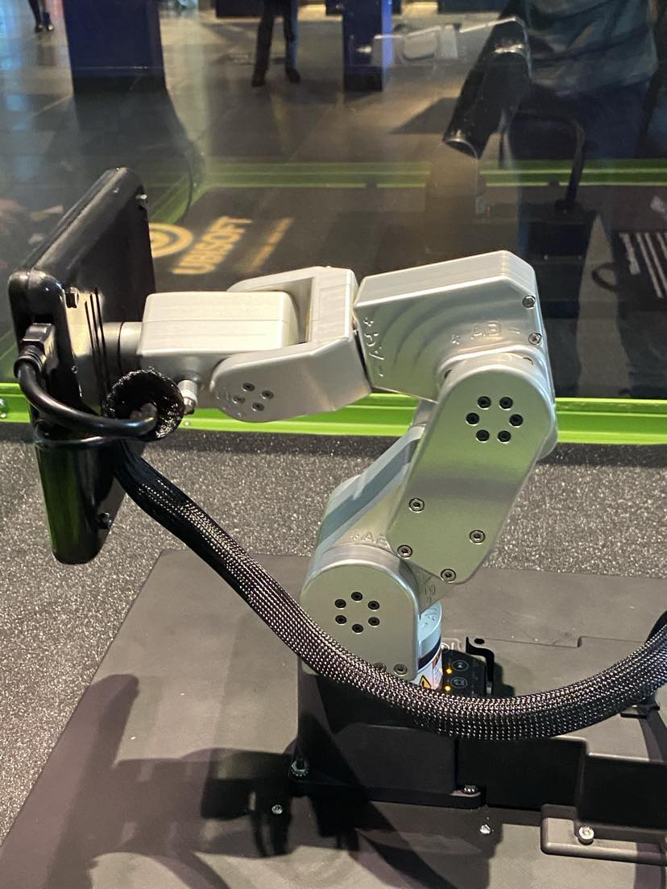
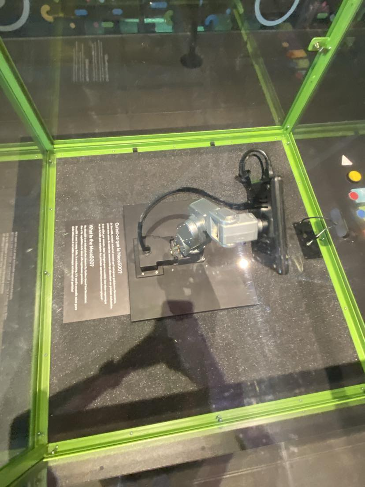
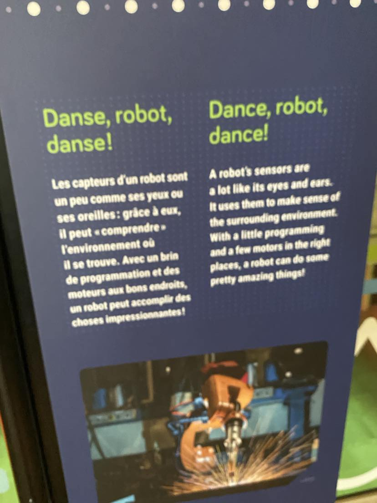
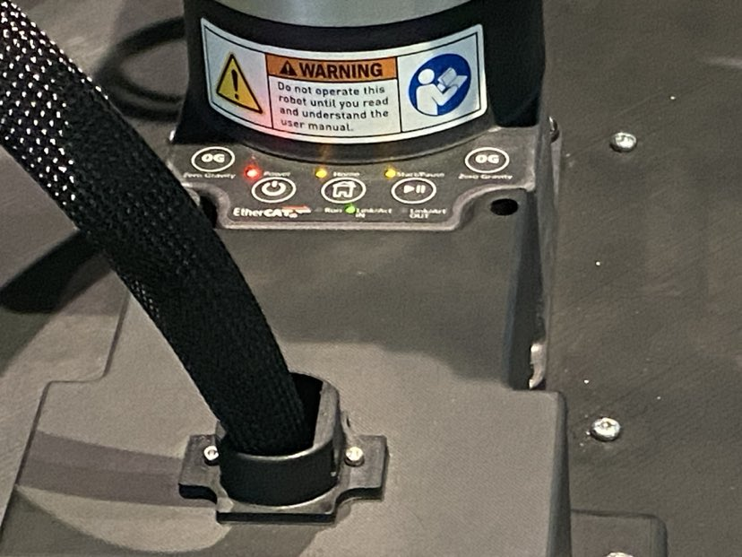

# Exposition : Explore - DANSE, ROBOT, DANSE!

## Sommaire 
**FAIRE A LA FIN**

### Informations Générales
  
<h5>Légende: affiche exposition
  
Source: https://www.centredessciencesdemontreal.com/blogue/danse-robot-danse</h5>

### Lieu de mise en exposition
- Centre des sciences à Montréal.
  
  
<h5>Légende: édifice vue entrée</h5>

### Type d'exposition
- Permanente

### Date de votre visite
- 10 Avril 2024

## Détails de l'Œuvre Principale

- **Titre :** DANSE, ROBOT, DANSE!
  
  
  <h5>Légende: œuvre vue globale</h5>
  
- **Firme :** Mecademic

- **Année :** 2013

## Description de l'Œuvre
Protégé d’une vitrine carrée aux arêtes vert pomme, le microrobot industriel a une manière bien particulière d’interagir avec le visiteur. Il danse! Et sa chorégraphie, c’est le visiteur de l'exposition Exlore du Centre des sciences qui la crée en choisissant et plaçant devant lui six blocs colorés décrivant des mouvements de danse ou des expressions faciales. C’est parti, le petit robot baisse la tête, l’oscille, part à droite, à gauche, fait un « Oh » d’étonnement puis sourit avant de s’immobiliser.
  <h5>Source: https://www.centredessciencesdemontreal.com/blogue/danse-robot-danse</h5>

### Diverses vues de l'exposition

<h5>œuvre vue frontale</h5>

<h5>œuvre vue partie droite</h5>

<h5>œuvre vue globale</h5>

<h5>œuvre vue rapprocher</h5>

<h5>œuvre vue plongée</h5>

<h3> Cartel </h3>

### Type d'installation
- Interactive

<h5>oeuvre en action</h5>

https://www.youtube.com/watch?v=l6HB6jVdrrU

### Mise en espace
- L'installation "DANSE, ROBOT, DANSE!" est exposée au centre de l'exposition Explore. Au cœur de l'espace, des vitres, avec des bordures de couleur vert pomme, et a l’intérieur il y a le robot Meca500. Le robot est posé sur une petite table au centre. Les visiteurs peuvent contrôler les mouvements du robot avec des des blocs colorés qui contrôlent les émotions du robot.

<h5>La mise en espace de l'œuvre</h5>

### Composantes et techniques
- L'exposition comprend des mécanismes sophistiqués pour déclencher des mouvements du robot. Des caméras optiques détectent les combinaisons de couleurs sur les blocs, envoyant des signaux au robot pour exécuter des danses prédéfinies.

<h5>Les boutons des capteurs de l'œuvre</h5>

<h5>Les fils qui connectent l'écran de l'œuvre</h5>

### Éléments nécessaires à la mise en exposition
- Un écran interactif est installé pour afficher le robot. Un système audio diffuse de la musique synchronisée avec les mouvements du robot.

  

