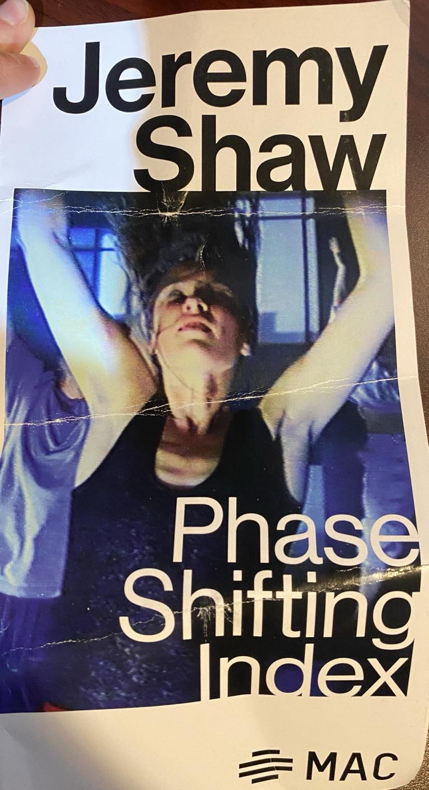
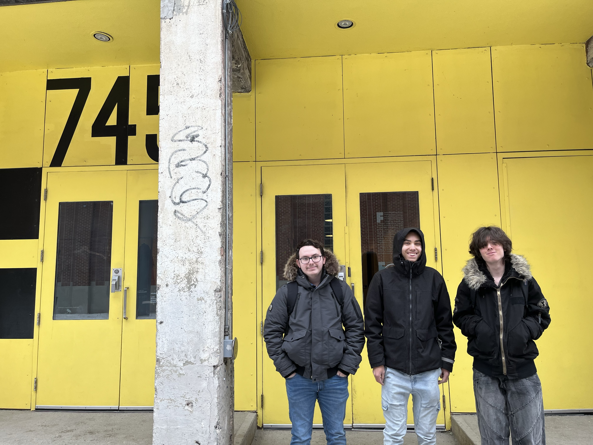
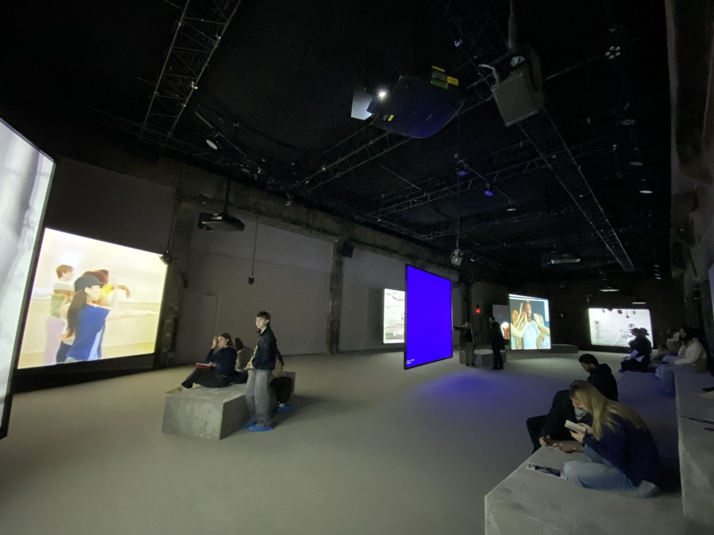
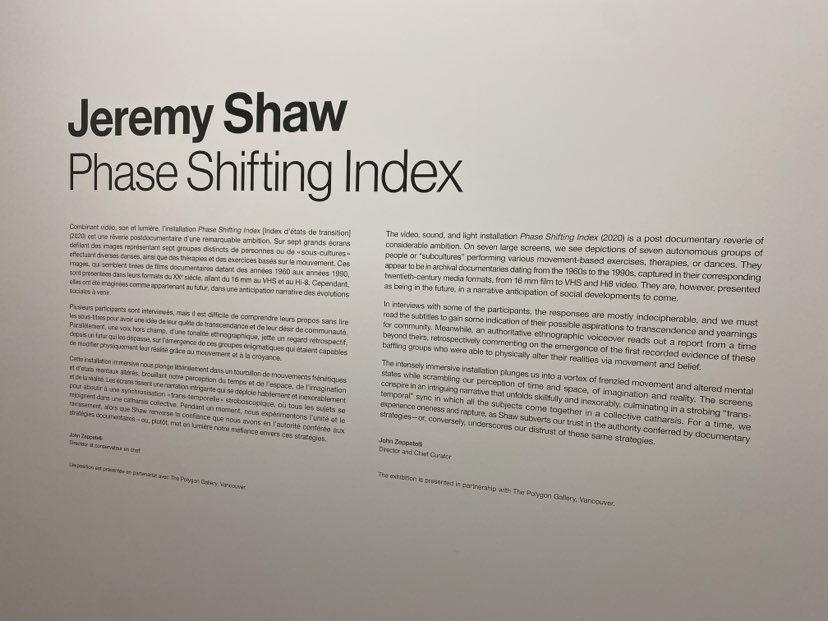
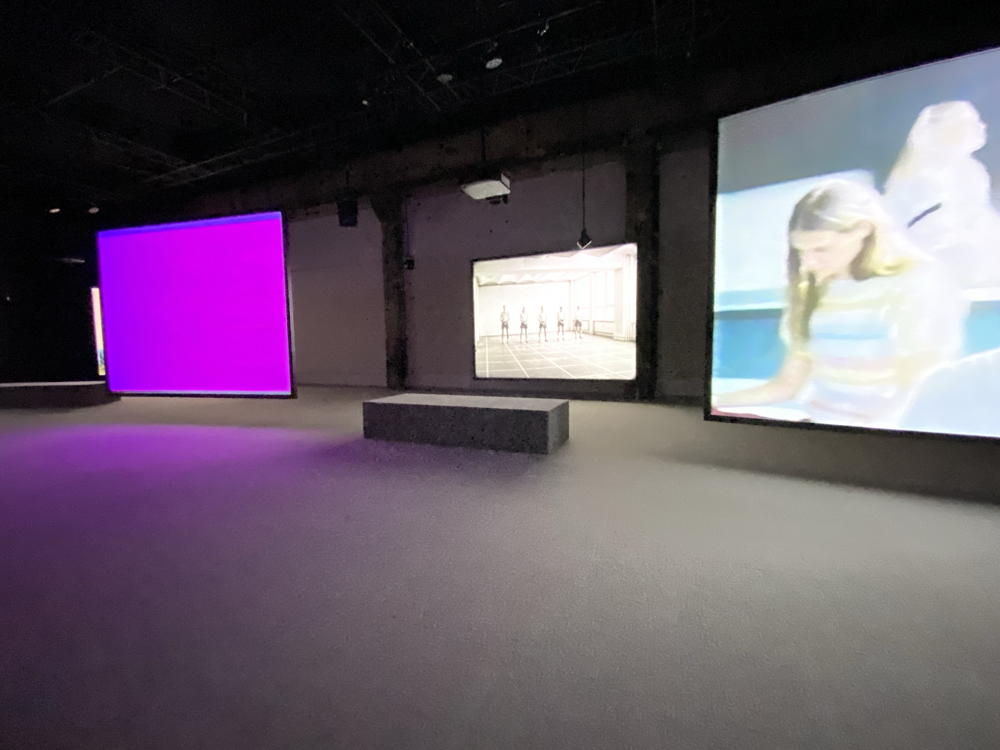
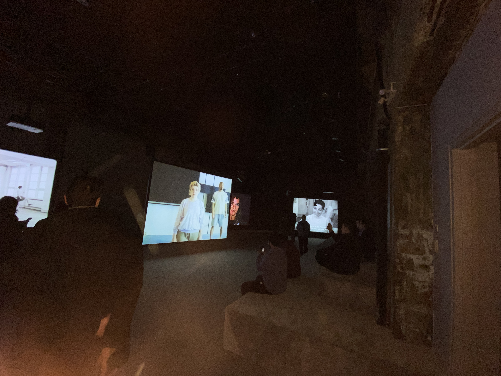
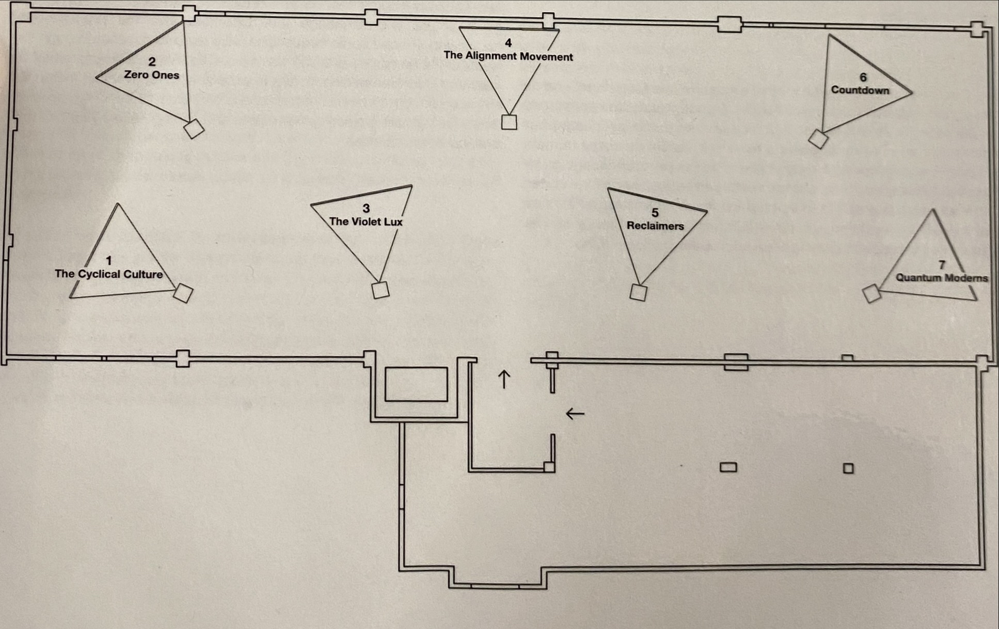

# Jeremy Shaw Exhibition - Phase Shifting Index 

<h2>Informations sur l'exposition</h2>

<h3> Le nom de l'exposition est: </h3>
  
Jeremy Shaw Phase Shifting Index

  <h3> Le lien d'exposition de l'oeuvre est: </h3>

Fonderie Darling à Montréal

<h3>Date de notre visite:</h3>

31 janvier 2024

## Œuvre principale 

<h3> Le titre de l'oeuvre est: </h3>
  
 Phase Shifting Index 

  

<h3>L'artiste qui a réaliser l'oeuvre est:</h3>
  
Jeremy Shaw

  
<h3>L'année de réalisation de l'oeuvre est en:</h3>

2020

## Description de l'œuvre 

<h3> Voici une description de l'oeuvre. </h3> 

 «Phase Shifting Index» de Jeremy Shaw est une œuvre immersive avec des vidéos de danse comtemporaine sur 7 écrans et une bande sonore. Les visiteurs se déplacent dans la pièce pour une expérience interactive, stimulant la réflexion sur la réalité et la conscience humaine. C'est une expérience artistique vraiment mémorable.

## Caractéristiques de l'installation 

<h3> Le type d'installation pour cette oeuvre est: </h3>
  
 Immersive 

  https://github.com/Benjamin4253/H24_V11_inspirations_Ferland/blob/main/JEREMY_SHAW_phase_shifting_index/medias/entree_edifice.png
   
<h3> Voici une description de la mise en espace de l'exposition. </h3> 

 L'exposition «Phase Shifting Index» prend place dans une salle où sept écrans diffusent des vidéos de danses rituelles. Les visiteurs sont encouragés à se s'assoir sur les bancs pour une expérience immersive. L'éclairage ambiant crée une atmosphère chaleureuse, qui intensifie l'impact des images projetées. L'installation favorise une interaction émotionnelle, qui incitent les spectateurs à s'engager pleinement dans l'aventure. 

## Composantes et techniques 

<h3> Voici une description des composantes et techniques utilisées par l'artiste pour la réalisation de son oeuvre. </h3>

 «Phase Shifting Index», création de Jeremy Shaw, combine des vidéos de danses rituelles projetées sur sept écrans dans une vaste salle. Cette disposition permet une immersion interactive dans l'art de Shaw. La synchronisation astucieuse avec une bande sonore hypnotique crée une expérience sensorielle unique, captivant l'attention et suscitant une réflexion profonde sur la réalité et la conscience humaine. 
 Voici une description des éléments nécessaires à la mise en exposition </h3>

L'exposition «Phase Shifting Index» à nécessiter une grande salle avec des bancs qui en recouvrent son entièreté. La pièce est aussi accompagnés par une projection sur 7 écrans, un bon système audio et un éclairage approprié pour l'exposition.
 Voici une description de mon expérience personnelle lors de la visite de l'exposition <h3>

 Quand j'ai visité "Phase Shifting Index", les vidéos de danses rituelles sur les écrans m'ont vraiment captivé. En étant au milieu de la salle, ça m'a fait ressentir une connexion spéciale avec l'art de Jeremy Shaw. La musique qui complétait avec les images a rendu l'expérience encore plus intense et divertissante. Cette immersion m'a vraiment incité à réfléchir sur la nature de la réalité et de la conscience humaine.
 Voici ce qui m'a plu et ce qui m'a donné des idées en regardant l'exposition. </h3>

 Ce que j'ai vraiment apprécié dans l'exposition, c'est comment Jeremy Shaw a mélangé les vidéos et la musique de façon impressionnante. La coordination entre les vidéos de danses et la musique était vraiment bien exécuté. Ça a rendu l'expérience mémorable.
Ça m'a fait penser à rassembler plein de petites actions faites par des gens qui travaillent ensemble, pour former une seule chose. C'est comme si toutes ces parties différentes travaillaient ensemble pour créer quelque chose de complet, montrant que c'est puissant quand on coopère. Ça a stimulé ma créativité en me montrant comment différentes formes d'art peuvent travailler ensemble pour exprimer des émotions et des pensées importantes.
 Voici 1 aspect que vous ne souhaiteriez pas retenir de l'exposition. </h4> 

Un aspect de "Phase Shifting Index" que je modifierais serait peut-être la complexité de la synchronisation entre les vidéos et la musique. Bien que cela crée une expérience immersive, une simplification subtile pourrait rendre l'œuvre plus accessible à un public plus large.</p
