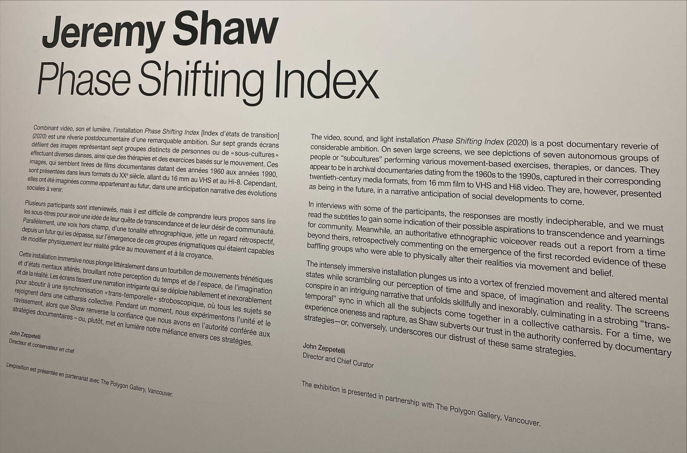

# Jeremy Shaw Exhibition - Phase Shifting Index

<h2>Informations sur l'exposition</h2>

<h3> Le nom de l'exposition est: </h3>
  
Jeremy Shaw Phase Shifting Index

  
<h3>Lieu de l'exposition:</h3>

Fonderie Darling Montréal

<h3>Date de notre visite:</h3>

31 janvier 2024

## Œuvre principale

<h3> Le titre de l'oeuvre est: </h3>
  
 Phase Shifting Index 

  

<h3>L'artiste qui a réaliser l'oeuvre est:</h3>
  
Jeremy Shaw

<h3>L'année de réalisation de l'oeuvre est en:</h3>

2020

## Description de l'œuvre

«Phase Shifting Index» de Jeremy Shaw est une œuvre immersive avec des vidéos de danse comtemporaine sur 7 écrans et une bande sonore. Les visiteurs se déplacent dans la pièce pour une expérience interactive, stimulant la réflexion sur la réalité et la conscience humaine. C'est une expérience artistique vraiment mémorable.

## Caractéristiques de l'installation

8. Type d'installation (contemplative, immersive, interactive): Immersive
9. Mise en espace: Il y a 7 écrans

## Composantes et techniques

<h3>Voici une description des composantes et techniques utilisées par l'artiste pour la réalisation de son oeuvre.</h3>

«Phase Shifting Index», création de Jeremy Shaw, combine des vidéos de danses rituelles projetées sur sept écrans dans une vaste salle. Cette disposition permet une immersion interactive dans l'art de Shaw. La synchronisation astucieuse avec une bande sonore hypnotique crée une expérience sensorielle unique, captivant l'attention et suscitant une réflexion profonde sur la réalité et la conscience humaine.
L'exposition «Phase Shifting Index» à nécessiter une grande salle avec des bancs qui en recouvrent son entièreté. La pièce est aussi accompagnés par une projection sur 7 écrans, un bon système audio et un éclairage approprié pour l'exposition.

## Expérience vécue

12. Expérience vécue: (Partagez votre expérience personnelle lors de la visite de l'exposition)

## Impressions et Réflexions

13. ❤️ Ce qui vous a plu, vous a donné des idées (et pourquoi - justifications): Lorsque les plans étaient synchronisés avec la musique et les lumières.

14. 🤔 Aspect que vous ne souhaiteriez pas retenir pour vos propres créations ou que vous feriez autrement et justifications: Éléments pertinents.
