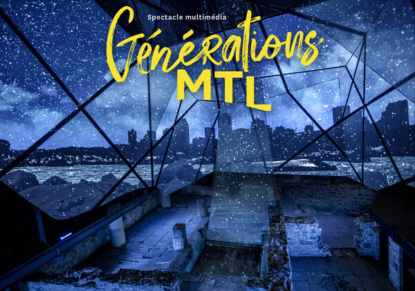
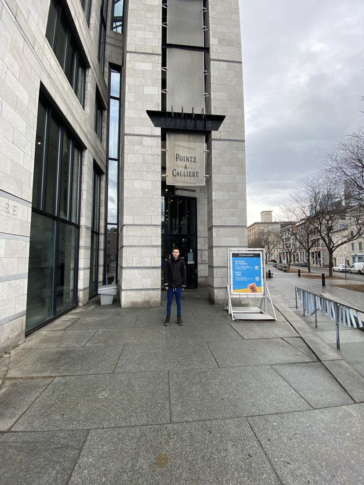
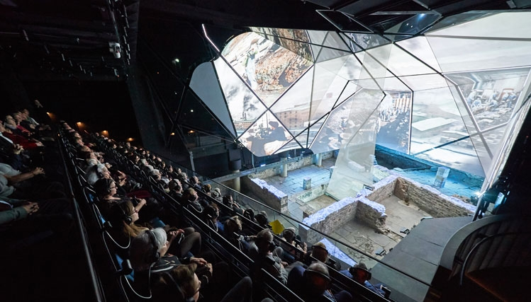
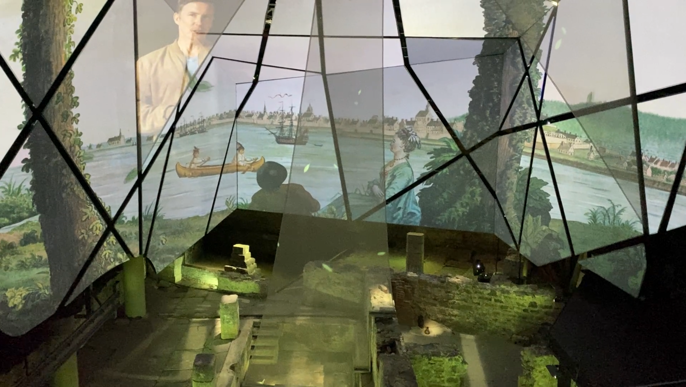
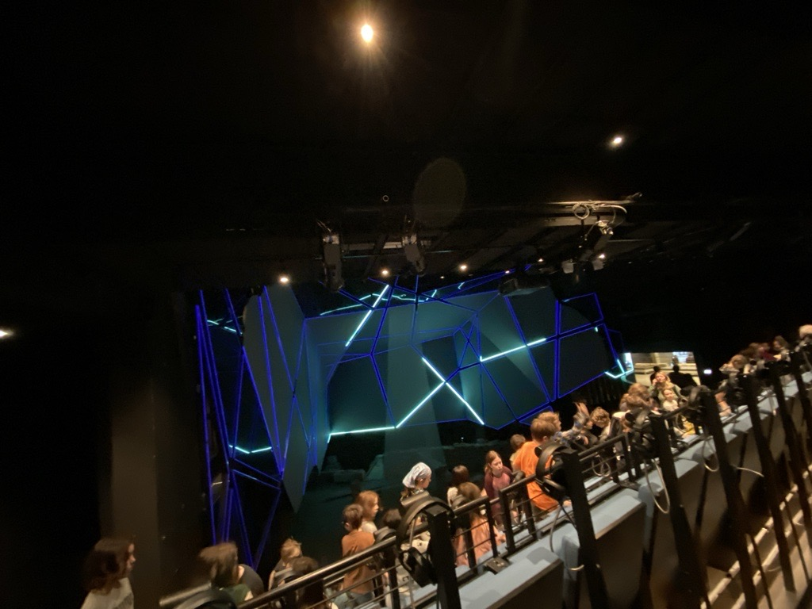
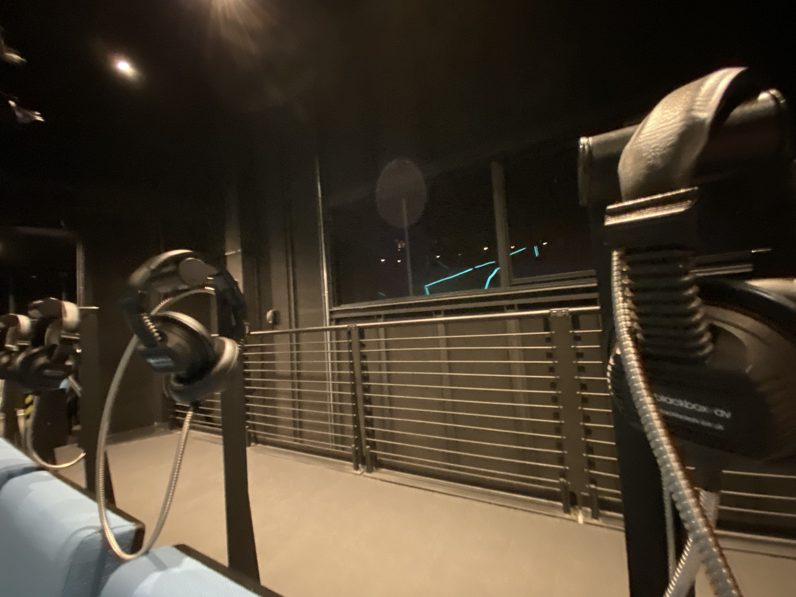
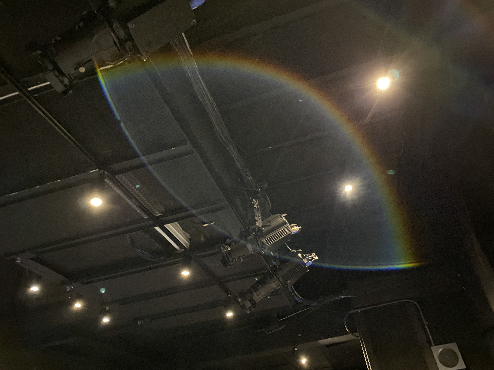
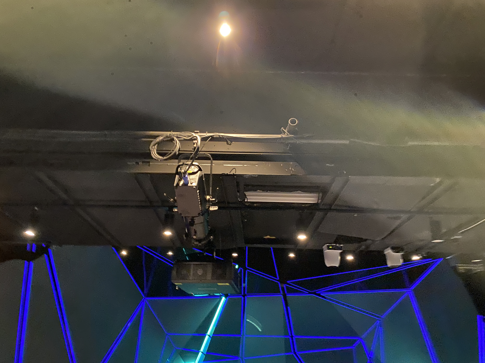

# Exposition Pointe-à-Callière - Generations Mtl

## Sommaire
- [Aperçu de l'Exposition](#aperçu-de-lexposition)
  - [Informations Générales](#informations-générales)
  - [Présentation](#présentation)
- [Détails de l'Œuvre Principale](#détails-de-lœuvre-principale)
  - [Titre : Générations MTL](#titre--générations-mtl)
  - [Firme : TKNL](#firme--tknl)
  - [Année : 2019](#année--2019)
- [Description de l'Œuvre](#description-de-lœuvre)
- [Caractéristiques Techniques](#caractéristiques-techniques)
  - [Installation](#installation)
    - [Projections Multimédias](#projections-multimédias)
    - [Artefacts Historiques](#artefacts-historiques)
  - [Mise en Espace](#mise-en-espace)
    - [Supports de Projection](#supports-de-projection)
    - [Câblage et Gestion des Fils](#câblage-et-gestion-des-fils)
    - [Éclairage Ambiant](#éclairage-ambiant)
- [Logistique d'Exposition](#logistique-dexposition)
- [Mon Expérience Personnelle](#mon-expérience-personnelle)
- [Impressions et Réflexions](#impressions-et-réflexions)
  - [Suggestions](#suggestions)
- [Conclusion](#conclusion)
- [Références](#références)

## Aperçu de l'Exposition

### Informations Générales
- **Nom de l'exposition :** Générations MTL
  
  
<h5>Légende: affiche exposition
  
Source: https://www.newswire.ca/fr/news-releases/le-lieu-de-fondation-de-montreal-plus-vivant-que-jamais--848569888.html">https://www.newswire.ca/fr/news-releases/le-lieu-de-fondation-de-montreal-plus-vivant-que-jamais--848569888.html</h5>

- **Lieu :** Pointe-à-Callière, Montréal
  
  

<h5>Légende: édifice vue entrée</h5>
  
- **Date de visite :** 28 février 2024

- **Type d'exposition :** permanente et intérieure.

## Détails de l'Œuvre Principale

- **Titre :** Générations MTL
  
  
  <h5>Légende: œuvre vue globale
    
  Source: https://www.passeportvacances.com/forfaits-musee-pointe-a-calliere-montreal-exposition-activite-familiale-culture-archeologie-tarif-direction
  Photographe: Romain Guilbault</h5>
  
- **Firme :** TKNL

- **Année :** 2019

## Description de l'Œuvre

Plongez dans l'histoire de Montréal depuis des gradins surplombant des ruines antiques ! *Générations MTL*, un spectacle vidéo unique, allie technologie et créativité pour captiver. Voyagez à travers les moments forts de la ville, découvrez ses bâtisseurs. Suivez le récit de six personnages, héritiers de traditions, qui racontent leur Montréal. Vibrez pendant 17 minutes au rythme de cette histoire spectaculaire, mettant en avant la technologie montréalaise. L'histoire prend vie devant vos yeux !

<h5>Légende: œuvre vue frontale</h5>

<h5>Légende: œuvre vue frontale</h5>

   *Cartel sur le site web: Depuis les gradins surplombant d’impressionnants vestiges archéologiques, l’histoire de Montréal revit sous vos yeux! Projeté sur une installation scénique unique au monde, le spectacle multimédia Générations MTL vous émerveillera tant par ses prouesses technologiques que par sa     sensibilité artistique. Telle une machine à remonter le temps, le spectacle vous entraine au cœur des événements marquants de la ville, à la découverte des gens qui ont contribué à bâtir Montréal. Laissez-vous porter par le récit enchanteur de six personnages qui, fiers héritiers des traditions de leurs       ancêtres, vous raconteront leur Montréal et ce qui en fait une métropole aussi unique. Vibrez au rythme de ce spectaculaire récit de 17 minutes mettant à profit des moyens technologiques qui font la réputation de Montréal.
  Jamais l’histoire n’aura été si vivante!*

  *Source du cartel: https://pacmusee.qc.ca/fr/expositions/detail/spectacle-multimedia-generations-mtl/</h4>*
 

### Installation

- **Type :** Immersive

[(https://youtu.be/CzKovrjxIaU)](https://youtu.be/CzKovrjxIaU)
<h5>Légende: œuvre vue parlante</h5>

<h5>Légende: œuvre vue frontale</h5>

<h5>Légende: œuvre vue arriere</h5>

## Fonction du dispositif multimédia

Le dispositif multimédia de l'exposition Générations MTL à Pointe-à-Callière anime l'histoire de Montréal.
Il met en avant le passé, aide à saisir les événements et favorise l'apprentissage tout en préservant la culture.

[(https://youtu.be/CzKovrjxIaU)](https://youtu.be/CzKovrjxIaU)
<h5>Légende: œuvre vue parlante</h5>

## Composantes et Techniques utilisées :

L'œuvre se compose exclusivement de projecteurs, des instruments qui illuminent les surfaces avec des images ou des vidéos.
Ces dispositifs essentiels créent une atmosphère immersive en projetant des images captivantes et des lumières dynamiques, 
amplifiant ainsi l'expérience visuelle des visiteurs.

<h5>Légende: œuvre vue lumiere</h5>

<h5>Légende: œuvre vue projecteur et lumiere</h5>

### Mise en Espace

L'œuvre "Générations MTL" est présentée dans une grande salle au musée Pointe-à-Callière. Des écrans longeant les murs diffusent l'histoire de Montréal.
Les projecteurs illuminent également le sol, créant une expérience immersive. Les visiteurs se déplacent librement.

<h5>Légende: œuvre vue globale</h5>

 **Description en mots de la mise en espace:** *Le plan de la mise en espace montre une grande salle rectangulaire au musée Pointe-à-Callière.
   Les murs longs sont équipés d'écrans de projection, avec des projecteurs montés au plafond pour éclairer le sol.*

## Mise en Exposition

**Projecteur:**

-  Des projecteurs diffusent l'œuvre sur les écrans.

<h5>Légende: œuvre vue projecteur et lumiere</h5>

**Éclairage Ambiant:**

-  L'éclairage ambiant est assuré par des luminaires LED, créant une atmosphère immersive.

<h5>Légende: œuvre vue lumiere</h5>

### Mon Expérience Personnelle

## Expérience vécue

Générations MTL m'a fasciné. Les projections murales m'ont transporté dans le passé de Montréal.
C'était une expérience captivante, éveillant ma curiosité pour l'histoire de la ville d'une manière incroyablement immersive.
**Appui visuel à intégrer**

## Ce qui vous a plu, vous a donné des idées

Les projections murales de Générations MTL m'ont inspiré. Elles sont captivantes pour raconter des histoires.
Je veux les utiliser dans mes futurs projets pour engager et éduquer le public de manière immersive.
**Appui visuel à intégrer**

## Aspect que vous ne souhaiteriez pas retenir pour vos propres créations ou que vous feriez autrement

Je changerais le rythme de l'exposition pour donner plus de temps aux visiteurs de penser et comprendre.
Moins d'infos à la fois, plus de pauses, et des zones calmes pour réfléchir. Ainsi, chacun pourrait mieux apprécier et se souvenir de sa visite.
**Appui visuel à intégrer**

## Références
