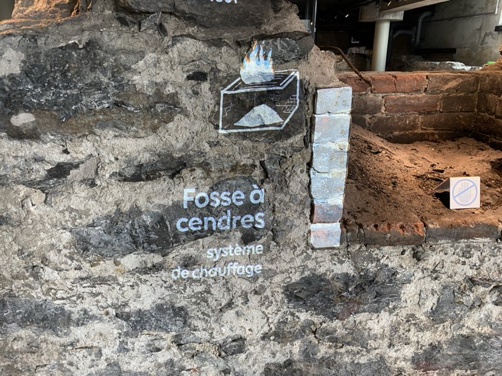
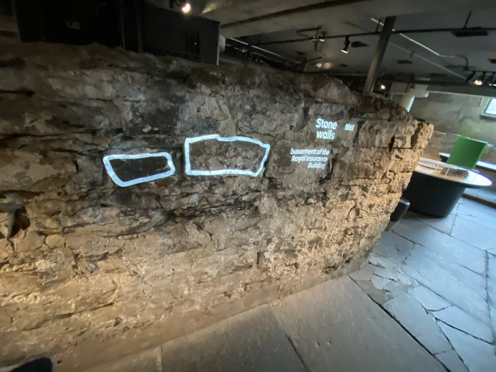
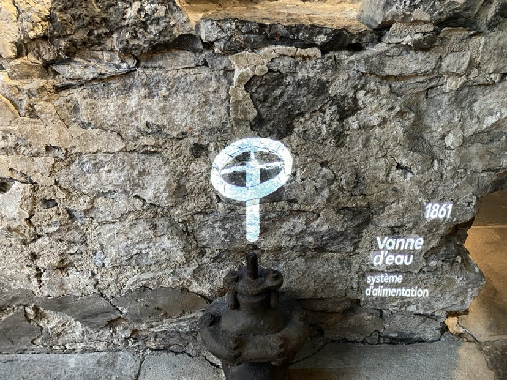

# Exposition Pointe-à-Callière - Generations Mtl

## Sommaire
- [Aperçu de l'Exposition](#aperçu-de-lexposition)
  - [Informations Générales](#informations-générales)
  - [Présentation](#présentation)
- [Détails de l'Œuvre Principale](#détails-de-lœuvre-principale)
  [Titre : Générations MTL](#titre--générations-mtl)
  [Firme : TKNL](#firme--tknl)
  [Année : 2019](#année--2019)
- [Description de l'Œuvre](#description-de-lœuvre)
- [Caractéristiques Techniques](#caractéristiques-techniques)
  - [Installation](#installation)
    - [Projections Multimédias](#projections-multimédias)
    - [Artefacts Historiques](#artefacts-historiques)
  - [Mise en Espace](#mise-en-espace)
    - [Supports de Projection](#supports-de-projection)
    - [Câblage et Gestion des Fils](#câblage-et-gestion-des-fils)
    - [Éclairage Ambiant](#éclairage-ambiant)
- [Logistique d'Exposition](#logistique-dexposition)
- [Mon Expérience Personnelle](#mon-expérience-personnelle)
- [Impressions et Réflexions](#impressions-et-réflexions)
  - [Suggestions](#suggestions)
- [Conclusion](#conclusion)
- [Références](#références)

## Aperçu de l'Exposition

### Informations Générales
- **Nom de l'exposition :** Générations MTL
  
  
<h5>Légende: affiche exposition
  
Source: https://www.newswire.ca/fr/news-releases/le-lieu-de-fondation-de-montreal-plus-vivant-que-jamais--848569888.html">https://www.newswire.ca/fr/news-releases/le-lieu-de-fondation-de-montreal-plus-vivant-que-jamais--848569888.html</h5>

- **Lieu :** Pointe-à-Callière, Montréal
  
  

<h5>Légende: édifice vue entrée</h5>
  
- **Date de visite :** 28 février 2024

- **Type d'exposition :** permanente et intérieure.

### Présentation
L'exposition *Phase Shifting Index* par Jeremy Shaw propose une expérience immersive à travers une installation vidéo multi-écran, explorant les frontières entre réalité et conscience à travers la danse contemporaine.

## Détails de l'Œuvre Principale

- **Titre :** Générations MTL
  
  
  <h5>Légende: œuvre vue globale
    
  Source: https://www.passeportvacances.com/forfaits-musee-pointe-a-calliere-montreal-exposition-activite-familiale-culture-archeologie-tarif-direction
  Photographe: Romain Guilbault</h5>
  
- **Firme :** TKNL

- **Année :** 2019

## Description de l'Œuvre

Plongez dans l'histoire de Montréal depuis des gradins surplombant des ruines antiques ! *Générations MTL*, un spectacle vidéo unique, allie technologie et créativité pour captiver. Voyagez à travers les moments forts de la ville, découvrez ses bâtisseurs. Suivez le récit de six personnages, héritiers de traditions, qui racontent leur Montréal. Vibrez pendant 17 minutes au rythme de cette histoire spectaculaire, mettant en avant la technologie montréalaise. L'histoire prend vie devant vos yeux !

# Manque un appui visuel
*La "Description de l'oeuvre" est abordée dans le texte sans support visuel comme le cartel + diverses vues*

## Caractéristiques Techniques

### Installation

- **Type :** Immersive <video src="medias/projection_systeme_alimentation.jpg" alt="projection_systeme_alimentation" width="150"/>

# Manque un appui visuel
*Le "Type d'installation" est abordée dans le texte sans support visuel comme une Vue parlante - vidéo ET photo qui nous permettent de bien comprendre le type d'installation*

  
- **Composantes et Techniques utilisées :**

**1.&nbsp;  Projections Multimédias :** Le musée utilise des vidéos et des images projetées sur des surfaces parfois irrégulières, (projection mapping). Cela permet d'adapter l'image projetée à la forme de la surface, rendant l'effet plus réaliste et captivant qui créer une expérience immersive qui transporte les visiteurs dans le temps, leur permettant de sentir et de comprendre la vie dans le Montréal historique.

**2.&nbsp;  Artefacts Historiques :** En plus des images et des activités interactives, il y a aussi de vrais objets du passé à voir. Cela peut être des outils, des vêtements ou d'autres choses que les gens utilisaient autrefois à Montréal. Ces objets aident les visiteurs à se connecter au passé de la ville en leur montrant des choses réelles qui ont été utilisées il y a longtemps.

*La première projection représente un système de chauffage :* 

<h5>Légende: projection systeme chauffage</h5>

*La deuxième projection représente un des murs de pierre du sous-sol du "Royal Insurance Building" :*

<h5>Légende: projection murs pierre</h5>

*La troisième projection représente un système d'alimentation :*  

<h5>Légende: projection systeme alimentation</h5>

### Mise en Espace

# Manque un appui visuel
La "mise en espace" est abordée dans le texte sans support visuel comme un croquis de la mise en espace ou une vue d'ensemble de la pièce avec dimensions.

## Mise en Exposition

**Supports de Projection:**

-  Des supports solides sont utilisés pour maintenir les écrans de projection en place de manière stable.

**Câblage et Gestion des Fils:**

-  Des organisateurs de câbles dissimulent et rangent les câbles le long des murs ou du sol.

-  Des caches-fils discrets préviennent les risques de trébuchement en masquant les câbles.

**Éclairage Ambiant:**

-  Des variateurs d'intensité lumineuse ajustent l'éclairage selon les besoins.
-  Des éclairages LED qui créent une ambiance immersive.

## Mon Expérience Personnelle

Visiter *Phase Shifting Index* a été une expérience révélatrice, la synergie entre les images et la musique a provoqué une profonde réflexion sur la nature humaine et notre perception du réel.

## Impressions et Réflexions

L'exposition m'a inspiré à envisager de nouvelles manières d'intégrer différentes formes d'art pour créer des expériences uniques et mémorables. Elle souligne l'importance de la collaboration créative et de l'innovation dans le domaine artistique.

### Suggestions
Bien que l'expérience globale soit enrichissante, une simplification de certains aspects techniques pourrait rendre l'œuvre plus accessible sans en diminuer la profondeur.

## Conclusion

L'exposition *Phase Shifting Index* de Jeremy Shaw offre un aperçu fascinant sur les possibilités de l'art contemporain pour provoquer la réflexion et l'émotion. Elle représente un investissement significatif dans la compréhension des interactions humaines avec l'art et la technologie.

## Références

- Affiche exposition : 
  - Site Web : 
  - Photographe : Nom de la personne
  

  
- Vue œuvre globale :
  - Site Web : [www.nomdusite.com/vue](www.nomdusite.com/vue)
  - Photographe : Nom de la personne
  
- Cartel et diverses vues :
  - Site Web : [www.nomdusite.com/cartel](www.nomdusite.com/cartel)
  - Photographe : Nom de la personne
  
- Mise en espace :
  - Site Web : [www.nomdusite.com/mise-en-espace](www.nomdusite.com/mise-en-espace)
  - Photographe : Nom de la personne
